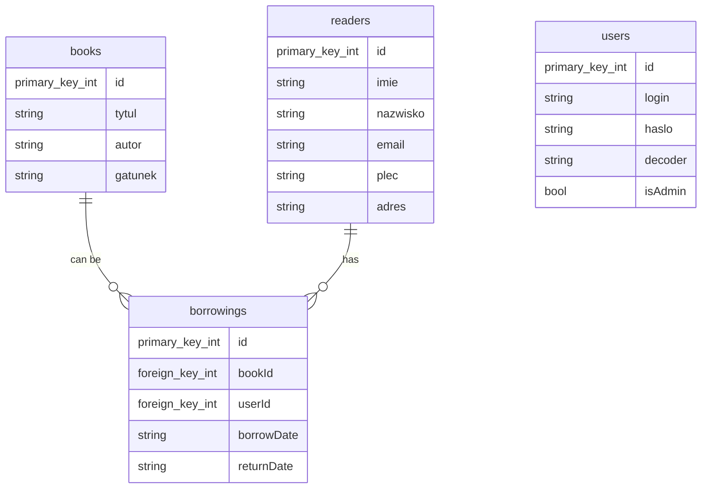

# Opis aplikacji:

Aplikacja biblioteki pozwala na zarządzanie katalogiem książek dostępnych, listą czytelników, oraz wypożyczeniami w przykładowej bibliotece.

# Funkcjonalności:

- Wyszukiwanie książek po id, tytule, autorze lub gatunku
- Wyszukiwanie czytelników po id, imieniu, nazwisku, emailu, płci i adresie
- Wyszukiwanie wyporzyczeń po imieniu, nazwisku, książce, dacie wypożyczenia i dacie oddania
- Dodawanie nowych pozycji do bazy
- Obsługa wypożyczeń i zwrotów książek
- Wyświetlanie Książek, Czytelników i Wyporzyczeń w formie tabeli

# Technologie:

Aplikacja została napisana w języku C# z wykorzystaniem technologii WPF wraz z pluginem Material Design do tworzenia interfejsu użytkownika. Do przechowywania danych została użyta baza danych MS SQL.
Instalacja i uruchomienie

1. Pobierz plik zip programu dostępny w zakładce release.
2. Rozpakuj skompresowany plik.
3. Uruchom plik wykonywalny .exe programu.

# Użytkowanie:
Po uruchomieniu aplikacji przed użytkownikiem wyświetli się panel logowania, należy tam wpisać dane logowania, a następnie kliknąć przycisk zaloguj się (dane domyślne *login*:**admin**, *hasło*: **admin**)

Po zalogowaniu się, użytkownik zostanie przeniesiony do głównego okna programu. Z górnego menu można wybrać interesującą nas opcję (np. wyszukiwanie książek, dodawanie nowych pozycji itp.).

Aby wyszukać książkę, należy wpisać odpowiednie słowo kluczowe w polu wyszukiwania, wyszukiwanie rozpocznie się automatycznie. Rezultaty wyszukiwania zostaną wyświetlone w tabeli panelu.

# Diagram ERD bazy danych:

# Testy:

